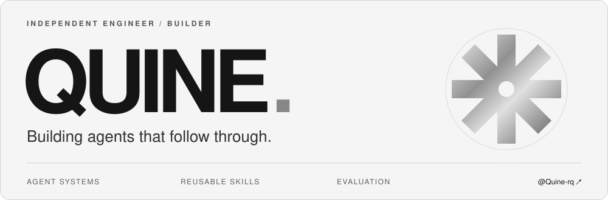
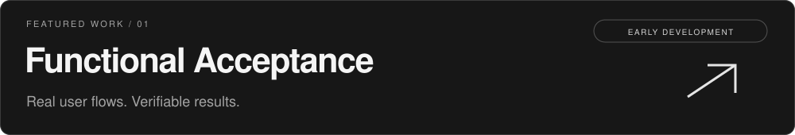

  

  <a href="https://github.com/Quine-rq/functional-acceptance"><b>Explore my work</b></a>
  &nbsp;&nbsp; / &nbsp;&nbsp;
  <a href="https://github.com/pulls?q=is%3Apr+author%3AQuine-rq">Contributions</a>
  &nbsp;&nbsp; / &nbsp;&nbsp;
  <a href="https://myverio.com">VERIO ↗</a>

 

### About

I'm **Quine**, focused on **multimodal agents, reusable agent skills, and evidence-driven acceptance**. I'm interested in how agents connect perception and tools to a user result that can actually be checked.

Also Founder & Lead Engineer at **[VERIO（星眸）](https://myverio.com)** — where I work across mobile apps, real-time services, AI, and connected hardware.

> 让 Agent 把事情真正做完：理解目标、执行任务、验证结果，并在失败后恢复。

 

### Stack

**Agent tooling & engineering**

  

Python · TypeScript · Node.js · Git · GitHub Actions

**Apps & services**

  

Flutter · Dart · Java / Spring Boot · SQLite · WebSocket · BLE

 

### Selected work

#### Functional Acceptance · Current focus

**[Functional Acceptance](https://github.com/Quine-rq/functional-acceptance)** helps coding agents verify real user flows, collect evidence, and leave repeatable checks. Examples span CSV export, SQLite workflows, and a browser/server/database journey.

**Explicit expectations. Observable results. Honest gaps.** Missing evidence stays **UNVERIFIED**; failed attempts and missed checks stay in the evaluation record.

Early development. Broader agent compatibility and reliable full-flow coverage are still being evaluated.

[Explore the project →](https://github.com/Quine-rq/functional-acceptance#readme) · [中文介绍 →](https://github.com/Quine-rq/functional-acceptance/blob/main/README.zh-CN.md)

 

#### Multimodal Agents · 2025 project history

**[multi-modal-agent](https://github.com/Quine-rq/multi-modal-agent)** contains a video-focused agent system spanning ingestion, retrieval, tool use, conversation memory, and a chat interface.

Based on the open-source **[Kubrick course](https://github.com/multi-modal-ai/multimodal-agents-course)** by **The Neural Maze and Neural Bits**, in collaboration with Pixeltable and Opik. The areas below describe the course-based repository and its 2025 history.

| Area | Inside the project |
| :--- | :--- |
| **Multimodal retrieval** | Video frames, captions, and audio transcripts indexed with Pixeltable for video search. |
| **Agent & MCP** | FastMCP tools, resources, and prompts connected to a Groq-powered agent through a custom MCP client. |
| **Memory & observability** | Conversation history, Opik traces, and prompt versioning across the agent workflow. |
| **Full-stack integration** | A FastAPI service, React / TypeScript chat UI, and Docker-based setup. |

The later 2025 commits cover practical integration fixes: [frame-sampling error handling](https://github.com/Quine-rq/multi-modal-agent/commit/e62c23e655e445dd9378761760633cecaa3b9d01), [FFmpeg / libGL container dependencies](https://github.com/Quine-rq/multi-modal-agent/commit/92e2baee9b7fdbc16e8f8f7a249494ab4d711301), and [the missing UI utility module](https://github.com/Quine-rq/multi-modal-agent/commit/8a8bca8eaa9da68dc3a9118ba095a8d2e8d883c7).

Python · FastAPI · FastMCP · Pixeltable · Groq · Opik · React · TypeScript · Docker · FFmpeg

[Explore the repository →](https://github.com/Quine-rq/multi-modal-agent#readme) · [Browse 2025 commits →](https://github.com/Quine-rq/multi-modal-agent/commits/main/?since=2025-01-01&until=2025-12-31T23%3A59%3A59Z)

 

### Contributions

Contributing fixes to **[Hermes Desktop](https://github.com/fathah/hermes-desktop)**, a desktop companion for Hermes Agent.

| Focus | Contribution |
| :--- | :--- |
| **Model identity** | [Distinct SSH endpoints stay distinct ↗](https://github.com/fathah/hermes-desktop/pull/945) |
| **Remote context** | [Read the active remote model's context length ↗](https://github.com/fathah/hermes-desktop/pull/946) |
| **Session lifecycle** | [Reflect local archive and restore state ↗](https://github.com/fathah/hermes-desktop/pull/947) |
| **Configuration** | [Preserve Windows CRLF platform settings ↗](https://github.com/fathah/hermes-desktop/pull/943) |

Submitted contributions. Each PR links to its current review and merge status.

 

### My engineering loop

**Define the outcome → Trace the real flow → Exercise failure paths → Verify with evidence**

Recovery, concurrency, weak networks, and state consistency are part of the feature. A successful command is one observation; the user's result is the acceptance criterion.

---

  <b>Building something with agents?</b> 
  I'm interested in reusable skills and reproducible acceptance cases.  
  <a href="https://github.com/Quine-rq/functional-acceptance/issues">Share a case ↗</a>

